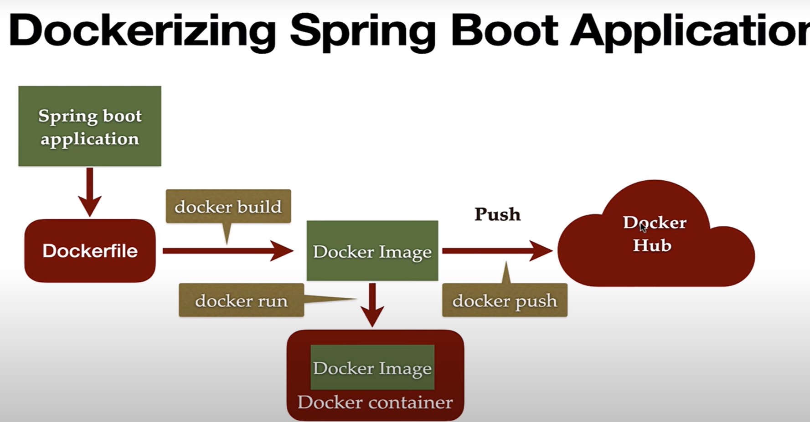

# Dockerizing a Spring Boot Application

## Steps / Topics
1. Create a Spring Boot Project and Build a Simple REST API \
2. Create a Dockerfile to Build a Docker Image \
3. Build Docker Image from Dockerfile \
   - Run the following command from the directory containing the Dockerfile \ 
     * with default `tag: docker build -t springboot-docker-demo .` \
     * with tag: `docker build -t springboot-docker-demo:0.1.RELEASE .` \
4. Run Docker Image in a Docker Container
   - `docker run -p 8080:8080 springboot-docker-demo`
   - Detached mode: `docker run -p 8080:8080 -d springboot-docker-demo`
   - Access logs: `docker logs -f [CONTAINER ID]`
   - Stop docker running in background: `docker stop [CONTAINER ID]`
5. Push Docker Image to DockerHub
   - Create an account in DockerHub \
   - Authenticate from terminal with existing credential \
   `docker login` 
   - Associate the local docker image with the repository on DockerHub \
   `docker tag [IMAGE NAME] [REPOSITORY ON DOCKERHUB]:[TAG NAME]` \
   `docker tag springboot-docker-demo ahmedpi/springboot-docker-demo:0.1.RELEASE` \
   - Push docker image into DockerHub \
   `docker push ahmedpi/springboot-docker-demo:0.1.RELEASE`
6. Pull Docker Image from DockerHub \
   `docker pull ahmedpi/springboot-docker-demo:0.1.RELEASE`